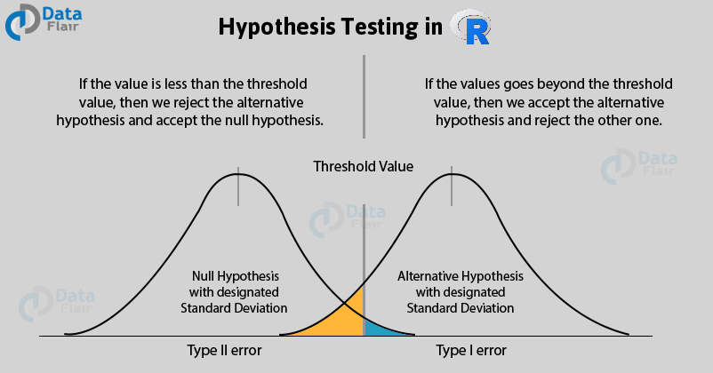
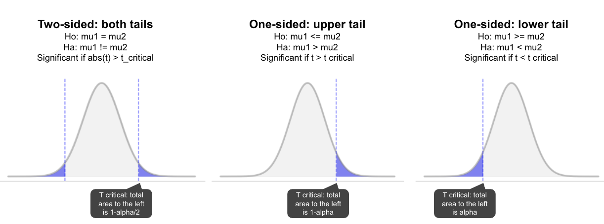

####Estadística Inferencial
Usa la teoría de la probabilidad para estudiar una **muestra** representativa, idealmente aleatoria, y realizar inferencias sobre una **población** de interés.
```{r, echo=FALSE}
set.seed(1)
x <- seq(-20, 20, by = .1); y <- dnorm(x,mean=1,sd=7)
plot(x,y, type="l"); lines(x=x[1:100],y=y[1:100], type="h", col="cyan")
```
---
####Inferencia estadística: datos importantes

- Existen dos formas de hacer inferencia estadística: mediante **intervalos de confianza** o mediante **pruebas de hipótesis**.

- En los **intervalos de confianza**, calculas un intervalo donde puede caer tu predicción de la variable, con cierto nivel de confiabilidad (99%, 95%, 90%, etc).

- La **prueba de hipótesis** es un procedimiento de varios pasos, donde pones a prueba la hipótesis nula (no cambio) con la finalidad de rechazarla, y poder aceptar la hipótesis alternativa con cierto nivel de confianza. Se calcula un p-value.

- Hay 4 pasos principales para la P. de Hipótesis: 
1)Formular H0 y HA. 2)Planificar el análisis y los criterios de decisión. 3)Analizar los datos de la muestra. 4)Interpretar la decisión.

- El *p- value* es la probabilidad de encontrar un valor tan extremo como el encontrado si la hipótesis nula fuera verdadera, por ello debe ser pequeño (menor que alfa).

- Existen pruebas paramétricas y no paramétricas, para estudiar poblaciones que siguen una distribución normal, o no la siguen, respectivamente.
---
####Prueba de hipótesis: Se trata de probabilidades

---
####Hipótesis bilaterales y unilaterales

---
####Pruebas paramétricas
Para la media de poblaciones con distribución normal: Prueba z. Cuando n > 30 y sigma conocida.
.pull-left[
```{r, message=FALSE, warning=FALSE}
library("ggplot2")
data(msleep)
hist(msleep$sleep_total, col="pink")
```
]
.pull-right[
```{r, message=FALSE, warning=FALSE}
#install.packages("BSDA")
library(BSDA)
z.test(msleep$sleep_total,mu=8, sigma.x=8) #media=8h
```
La media es 10.43, no 8.
]
---
Contraste unilateral, ¿la media es menor que 8?
```{r}
z.test(msleep$sleep_total,  mu=8, sigma.x=8, alternative="less")
```
Contraste unilateral, ¿la media es mayor que 8?
```{r}
z.test(msleep$sleep_total,  mu=8, sigma.x=8, alternative="greater")
```

---
Para la media de poblaciones con distribución normal. Prueba t.
.pull-left[
```{r}
library("ggplot2")
data(msleep)
hist(msleep$sleep_total, col="skyblue")
```
]
.pull-right[
```{r}
t.test(msleep$sleep_total,mu=8)#media=8h
```
La media es 10.4, no 8.
]
---
Contraste unilateral, ¿la media es menor que 8?
```{r}
t.test(msleep$sleep_total,  mu=8, alternative="less")
```
Contraste unilateral, ¿la media es mayor que 8?
```{r}
t.test(msleep$sleep_total,  mu=8, alternative="greater")
```
---
####Hacer un test de normalidad
El test Shapiro-Wilk es un test que evalúa la normalidad de los datos.
La H0 es que los datos siguen una distribución normal. Un p-value pequeño sirve para rechazar la hipótesis nula.
```{r}
shapiro.test(msleep$sleep_total)
```
---
Diferencia entre la media de dos poblaciones
.pull-left[
```{r}
library("dplyr")
x<-select(msleep, vore, sleep_total)
head(x)
```
]
.pull-right[
```{r}
ggplot(x, aes(x=vore, y=sleep_total, 
col=vore, fill=vore))+
geom_boxplot()
```
]
---
####Prueba t entre insectivoros y omnivoros
```{r}
x1<-filter(x,vore=="omni"|vore=="insecti")%>% arrange(vore)
head(x1)
t.test(sleep_total~vore,data=x1, alternative="greater")
```
---
Gráfica de los distintos "vore"
```{r}
ggplot(x1,aes(x=vore,y=sleep_total,col=vore))+
geom_boxplot()+theme_minimal()
```
---
Prueba t entre el peso de chicos y chicas
```{r}
boys = c(60,65,51,51,60,56,52,52,55,53,50,55,59,53,51,57,60,50,55,52)
girls = c(46,45,37,47,50,46,35,41,40,45,34,42,42,43,37,47,45,50,45,42)
```
.pull-left[
```{r}
boxplot(list(boys,girls),
      col=c("red","blue"))
```
]
.pull-right[
```{r}
t.test(x=boys, y=girls,var.equal = F,
paired = FALSE,alternative = "greater")
```
]
---
Problema de la función biliar
####Se midió la función de la vesícula biliar antes y después de una operación para eliminar el reflujo gastroesofágico (fracción de eyección) ¿Es posible concluir que la operación mejora la función vesicular (GBEF)?
```{r}
pre= c(22,63.3,96,9.2,3.1,50,33,69,64,18.8,0,34)
post= c(63.5,91.5,59,37.8,10.1,19.6,41,87.8,86,55,88,40)
```
.pull-left[
```{r}
boxplot(list(pre,post),
      col=c("red","blue"))
```
]
.pull-right[
```{r}
t.test(x=pre, y=post,var.equal = F,
paired = TRUE,alternative = "less")
```
]
---
####Test wilcoxon-Mann-Whitney. 
Alternativas **no paramétricas** para la media de dos poblaciones. 
Mann-Whitney --> No pareadas. Wilcoxon --> Pareadas
```{r}
wilcox.test(sleep_total~vore, data=x1, alternative="greater")
wilcox.test(x=boys, y=girls, alternative="greater")
```
---
####Comparaciones múltiples (paramétricas)
Anova - Test Tukey
```{r}
dat<-read.table("bones.txt", header=TRUE)
ggplot(data = dat, aes(x = G, y = BS, color = G)) + geom_boxplot()
```
---
```{r}
anova <- aov(dat$BS ~ dat$G)
summary(anova)
TukeyHSD(anova)
```
---
####T test por pares
```{r}
pairwise.t.test(x = dat$BS, g = dat$G, p.adjust.method = "holm",
pool.sd = TRUE, paired = FALSE, alternative = "two.sided")
```
---
####Comparaciones múltiples (no paramétricas)
Test Kruskal-Wallis
```{r}
kruskal.test(dat$BS ~ dat$G, data = dat)
pairwise.wilcox.test(x=dat$BS, g=dat$G, paired=F, p.adjust.method = "holm" )
```
---
####Comparaciones múltiples pareadas (no paramétricas)
Test friedman
.pull-left[
```{r}
val <- c( 9, 5, 2, 6, 3, 1, 7, 
6, 4, 11, 5, 1, 8, 4, 3, 10, 4, 1)
h <- factor( rep( c( "m", "t", "n" ), 6 ) )
sujeto <- factor( rep( 1:6, each = 3 ) )
datos <- data.frame( val, h, sujeto )
head(datos,n=10)
```
]
.pull-right[
```{r}
ggplot(data = datos, mapping = aes(x = h, 
y = val, col = h)) +
geom_boxplot()+theme_minimal()
```
]
---
```{r}
friedman.test(datos$val, datos$h, datos$sujeto)
```

```{r}
pairwise.wilcox.test(datos$val, datos$h, paired = TRUE, p.adjust.method = "none")
```
---
###ggpubr 

 - Librería con funciones para generar y customatizar basadas en ggplot2 listas para publicación.
 
 - Libreria para agregar estadística a las gráficas y más, tienes dos funciones principales de estadística.
 
 - **compare_means()**. Genera comparaciones estadísticas por distintos métodos. compare_means(formula, data, method = "wilcox.test", paired = FALSE,
group.by = NULL, ref.group = NULL, ...)
  
 - **stat_compare_means()**. Agrega estadísticas a las gráficas. stat_compare_means(mapping = NULL, comparisons = NULL hide.ns = FALSE,
label = NULL,  label.x = NULL, label.y = NULL,  ...)
                   
 - Otra gramática para las gráficas.
---
####Usando ggpubr
```{r}
library("ggpubr")
data("ToothGrowth")
head(ToothGrowth)
compare_means(len ~ supp, data = ToothGrowth)
```
---
```{r, fig.align='center'}
p <- ggboxplot(ToothGrowth,x="supp",y="len",
color = "supp", palette="jco",add="jitter")
p + stat_compare_means()
```
---
```{r, fig.align='center'}
p + stat_compare_means(method = "t.test")
```
---
####Comparar dos muestras pareadas
Haciendo el análisis
```{r}
compare_means(len ~ supp, data = ToothGrowth, paired = TRUE)
```
---
Graficando los datos
```{r, fig.align='center'}
ggpaired(ToothGrowth, x="supp", y="len", color="supp",line.color="gray",palette="jco")+
stat_compare_means(paired = TRUE)
```
---
####Comparar más de dos grupos
Hacer un wilcoxon por pares
```{r}
compare_means(len~dose,data=ToothGrowth)
```
Hacer un anova
```{r}
compare_means(len~dose,data=ToothGrowth, 
method = "anova")
```
---
Graficar los datos con p-value
.pull-left[
```{r}
ggboxplot(ToothGrowth,x="dose",
y="len",color ="dose",palette="jco")+ 
stat_compare_means()
```
]
.pull-right[
```{r}
ggboxplot(ToothGrowth,x="dose",
y="len",color="dose",palette="jco")+
stat_compare_means(method="anova")
```
]
---
Kruskal wallis y wilcoxon por pares
```{r setup, warning=FALSE}
my_comparisons <-list( c("0.5", "1"), c("1", "2"), c("0.5", "2") )
ggboxplot(ToothGrowth, x = "dose", y = "len",
color = "dose", palette = "jco")+ 
stat_compare_means(label.y = 45)+
stat_compare_means(comparisons = my_comparisons, label.y = c(29, 35, 40))
```
---
Anova y pruebas t por pares
```{r}
ggboxplot(ToothGrowth, x = "dose", y = "len",
color = "dose", palette = "jco")+
stat_compare_means(method = "anova", label.y = 42)+ 
stat_compare_means(comparisons = my_comparisons, label.y = c(29, 35, 40), method = "t.test")  
```
---
Anova y pruebas t por pares
```{r}
ggboxplot(ToothGrowth, x = "dose", y = "len",
color = "dose", palette = "jco")+
stat_compare_means(method = "anova", label.y = 36)+ 
stat_compare_means(label = "p.signif", method = "t.test",ref.group = "0.5")  
```
---
Anova y pruebas t por pares
```{r}
ggviolin(ToothGrowth, x = "dose", y = "len",
color = "dose", palette = "jco", add="boxplot")+
stat_compare_means(method = "anova", label.y = 45)+ 
stat_compare_means(label = "p.signif", method = "t.test",ref.group = "0.5")  
```
---

