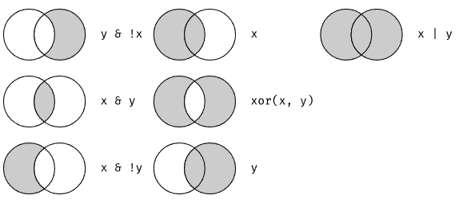

Cargar las siguientes librerias
```{r}
# install.packages("datos")
library(datos)
library(tidyverse)

```
Para repasar los verbos básicos de manipulación de datos de dplyr, usaremos vuelos. Este conjunto de datos contiene los 336, 776 vuelos que partieron de la ciudad de Nueva York durante el 2013. 

---
```{r}
head(vuelos)
```
---
- int significa enteros.

- dbl significa dobles, o números reales.

- chr significa vectores de caracteres o cadenas.

- dttm significa fechas y horas (una fecha + una hora).

Hay otros tres tipos comunes de variables que no se usan en este conjunto de datos:

lgl significa lógico, vectores que solo contienen TRUE (verdadero) o FALSE (falso).

fctr significa factores, que R usa para representar variables categóricas con valores posibles fijos.

date significa fechas.
---
# Lo básico de dplyr

dplyr te permiten resolver la gran mayoría de tus desafíos de manipulación de datos:

- Filtrar o elegir las observaciones por sus valores (filter() — del inglés filtrar).
- Reordenar las filas (arrange() — del inglés organizar).
- Seleccionar las variables por sus nombres (select() — del inglés seleccionar).
- Crear nuevas variables con transformaciones de variables existentes (mutate() — del inglés mutar o transformar).
- Contraer muchos valores en un solo resumen (summarise() — del inglés resumir).

---
# Filtrar filas con filter()

filter() te permite filtrar un subconjunto de observaciones según sus valores. El primer argumento es el nombre del data frame. El segundo y los siguientes argumentos son las expresiones que lo filtran. Por ejemplo, podemos seleccionar todos los vuelos del 1 de enero con:
```{r}
filter(vuelos, mes == 1, dia == 1)
```

---

Cuando ejecutas esa línea de código, dplyr ejecuta la operación de filtrado y devuelve un nuevo data frame. Las funciones de dplyr nunca modifican su input, por lo que si deseas guardar el resultado, necesitarás usar el operador de asignación, <-:

```{r}
ene1 <- filter(vuelos, mes == 1, dia == 1)
```

R imprime los resultados o los guarda en una variable. Si deseas hacer ambas cosas puedes escribir toda la línea entre paréntesis:

```{r}
(dic25 <- filter(vuelos, mes == 12, dia == 25))

```


---

# Comparaciones
Para usar el filtrado de manera efectiva, debes saber cómo seleccionar las observaciones que deseas utilizando los operadores de comparación. R proporciona el conjunto estándar: >, >=, <, <=, != (no igual) y == (igual).
---
# Operadores lógicos
Si tienes múltiples argumentos para filter() estos se combinan con “y”: cada expresión debe ser verdadera para que una fila se incluya en el output. Para otros tipos de combinaciones necesitarás usar operadores Booleanos: & es “y”, | es “o”, y ! es “no”. La figura @ref(fig:bool-ops) muestra el conjunto completo de operaciones Booleanas.


---

El siguiente código sirve para encontrar todos los vuelos que partieron en noviembre o diciembre:

```{r}
filter(vuelos, mes == 11 | mes == 12)
```


El orden de las operaciones no funciona como en español. No puedes escribir filter(vuelos, mes == (11 | 12)), que literalmente puede traducirse como “encuentra todos los vuelos que partieron en noviembre o diciembre”. En cambio, encontrará todos los meses que son iguales a 11 | 12, una expresión que resulta en ‘TRUE’ (verdadero). En un contexto numérico (como aquí), ‘TRUE’ se convierte en uno, por lo que encuentra todos los vuelos en enero, no en noviembre o diciembre. 
---
Una manera rápida y útil para resolver este problema es x %in% y (es decir, x en y). Esto seleccionará cada fila donde x es uno de los valores eny. Podríamos usarlo para reescribir el código de arriba:

```{r}
nov_dic <- filter(vuelos, mes %in% c(11, 12))
```

---
# Valores faltantes

filter() solo incluye filas donde la condición es TRUE; excluye tanto los valores FALSE como NA. Si deseas conservar valores perdidos, solicítalos explícitamente:

```{r}
library(tidyverse)

df <- tibble(x = c(1, NA, 3))
df
(filter(df, x > 1))
```
---
```{r}
filter(df, is.na(x) | x > 1)
```
---
# Reordenar las filas con arrange()

arrange() funciona de manera similar a filter() excepto que en lugar de seleccionar filas, cambia su orden. La función toma un data frame y un conjunto de nombres de columnas (o expresiones más complicadas) para ordenar según ellas. Si proporcionas más de un nombre de columna, cada columna adicional se utilizará para romper empates en los valores de las columnas anteriores:

```{r}
arrange(vuelos, anio, mes, dia)
```
---
Usa desc() para reordenar por una columna en orden descendente:


```{r}
arrange(vuelos, desc(atraso_salida))
```
---
Los valores faltantes siempre se ordenan al final:

```{r}
df <- tibble(x = c(5, 2, NA))
arrange(df, x)
```
```{r}
arrange(df, desc(x))
```
---
# Seleccionar columnas con select()

No es raro obtener conjuntos de datos con cientos o incluso miles de variables. En este caso, el primer desafío a menudo se reduce a las variables que realmente te interesan. select() te permite seleccionar rápidamente un subconjunto útil utilizando operaciones basadas en los nombres de las variables.

```{r}
# Seleccionar columnas por nombre
select(vuelos, anio, mes, dia)
```
---
```{r}
# Seleccionar todas las columnas entre anio y dia (incluyente)
select(vuelos, anio:dia)
```
---

```{r}
# Seleccionar todas las columnas excepto aquellas entre anio en dia (incluyente)
select(vuelos, -(anio:dia))
```
---
Hay una serie de funciones auxiliares que puedes usar dentro de select():

- *starts_with("abc")*: coincide con los nombres que comienzan con “abc”.

- *ends_with("xyz")*: coincide con los nombres que terminan con “xyz”.

- *contains("ijk")*: coincide con los nombres que contienen “ijk”.

- *matches("(.)\\1")* : selecciona variables que coinciden con una expresión regular. Esta en particular coincide con cualquier variable que contenga caracteres repetidos.

- *num_range("x", 1:3)*: coincide con x1,x2 y x3.
---


*df <- rename(df, new_name = old_name)*


```{r}

(rename(vuelos, cola_num = codigo_cola))
```
---
Otra opción es usar select() junto con el auxiliar everything() (todo, en inglés). Esto es útil si tienes un grupo de variables que te gustaría mover al comienzo del data frame.

```{r}
select(vuelos, fecha_hora, tiempo_vuelo, everything())
```
---
Además de seleccionar conjuntos de columnas existentes, a menudo es útil crear nuevas columnas en función de columnas existentes. Ese es el trabajo de mutate() (del inglés mutar o transformar).

mutate() siempre agrega nuevas columnas al final de un conjunto de datos, así que comenzaremos creando un conjunto de datos más pequeño para que podamos ver las nuevas variables.


```{r}
vuelos_sml <- select(vuelos,
  anio:dia,
  starts_with("atraso"),
  distancia,
  tiempo_vuelo
)

```
---

```{r}
mutate(vuelos_sml,
  ganancia = atraso_salida - atraso_llegada,
  velocidad = distancia / tiempo_vuelo * 60
)
```
---

```{r}
mutate(vuelos_sml,
  ganancia = atraso_salida - atraso_llegada,
  horas = tiempo_vuelo / 60,
  ganacia_por_hora = ganancia / horas
)
```

---
#Si solo quieres conservar las nuevas variables, usa transmute():

```{r}
transmute(vuelos,
  ganancia = atraso_salida - atraso_llegada,
  horas = tiempo_vuelo / 60,
  ganancia_por_hora = ganancia / horas
)
```
---
# Referencias

https://es.r4ds.hadley.nz/05-transform.html#filtrar-filas-con-filter